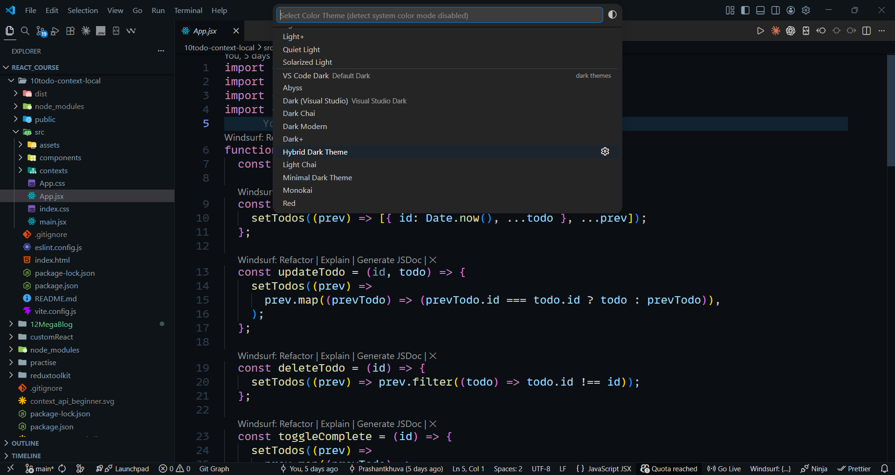

# 🌙 Minimal Dark Theme Pro

A premium, clean, and modern dark theme for Visual Studio Code — designed for developers who value focus, clarity, and aesthetics.

---

## 🚀 Why Minimal Dark Theme Pro?

Most themes are either too colorful or too dull.

This theme is built with a perfect balance:

* ✨ Clean UI (no visual noise)
* 🎯 Clear syntax hierarchy
* 👀 Eye-friendly colors for long coding sessions

---

## ✨ Key Features

* 🎨 Minimal & distraction-free interface
* ⚡ Balanced syntax highlighting (no color overload)
* 🔥 Clean HTML, JS, JSON highlighting
* 👁️ Comfortable for long coding hours
* 🧠 Improves focus and readability

---

## 🧪 Designed For

* Backend Developers
* Frontend Developers
* Students learning to code
* Anyone who codes for long hours

---

## 📸 Preview

### Editor View




---

## ⚙️ Recommended Settings

```json
{
  "editor.fontFamily": "'JetBrains Mono', monospace",
  "editor.fontSize": 14,
  "editor.fontLigatures": true,
  "editor.wordWrap": "on"
}
```

---

## 🎨 Included Themes

* 🌑 Minimal Dark Theme (Clean UI)
* 🌙 Hybrid Dark Theme (Balanced contrast)

---

## 🛠️ Installation

1. Open VS Code
2. Go to Extensions
3. Search: **Minimal Dark Theme Pro**
4. Click Install

---

## ❤️ Support

If you like this theme:

⭐ Star the repo
🚀 Share with others
💻 Use it daily

---

## 👨‍💻 Author

**Prashant Khuva**
Backend Developer | Building in Public 🚀
