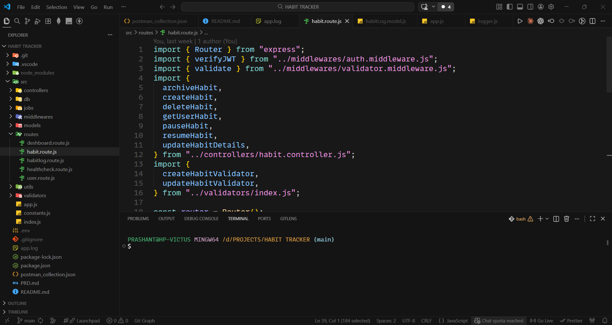

# 🌙 Minimal Dark Theme

A clean, minimal, and modern dark theme for Visual Studio Code.

---

## 🎯 Why this theme?

This theme is designed for developers who:

* Code for long hours
* Want a distraction-free environment
* Prefer a clean and minimal UI

Special focus was given to:

* Smooth contrast for better readability
* Clean interface with no visual noise
* Highlighted syntax for better clarity

---

## 🌑 Dark Theme

> The only version — crafted for a premium coding experience

* Deep dark background (easy on eyes)
* Highlighted functions, variables, and strings
* Clean sidebar and activity bar
* Balanced contrast for long sessions

---

## ✨ Features

* 🎨 Clean and minimal UI
* 🔥 Highlighted active tab
* ⚡ Customized syntax highlighting
* 👀 Comfortable for long coding sessions
* 🧠 Better focus with reduced distractions

---

## 📸 Preview

### Editor



---

## ⚙️ Recommended Settings

For best experience:

```json id="j3c1a9"
"editor.fontFamily": "'MonoLisa Nerd Font Mono', 'JetBrains Mono', monospace",
"editor.fontSize": 14,
"terminal.integrated.fontSize": 13,
"editor.wordWrap": "on",
"editor.fontLigatures": true
```

---

## 🛠️ Installation

1. Open VS Code
2. Go to Extensions
3. Search: **Minimal Dark Theme**
4. Click Install

---

## 💡 Who is this for?

* Developers
* Students
* Backend / frontend engineers

---

## 🚀 Future Improvements

* Additional color tuning
* Language-specific enhancements
* Community feedback updates

---

## 👨‍💻 About Author

**Prashant Khuva**
Backend Developer | Building in Public 🚀

---

## ⭐ Support

If you like this theme:

* Give it a ⭐ on GitHub
* Share with your friends
* Use it daily 😎

---
